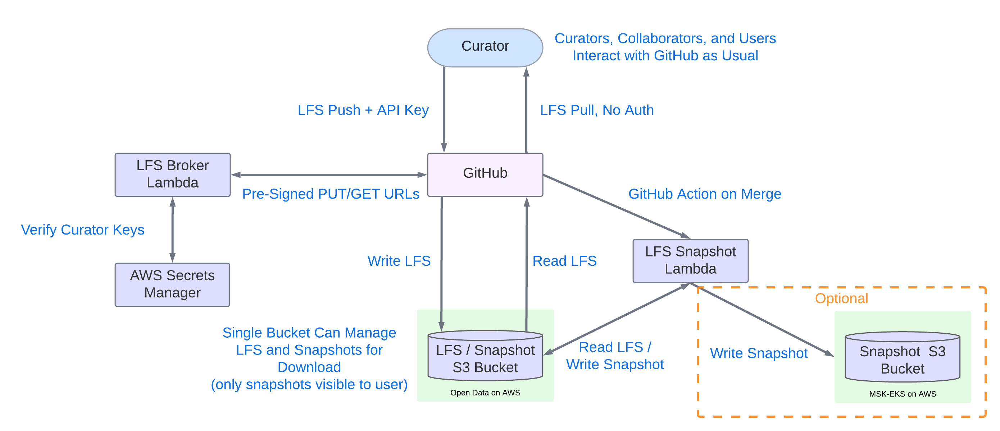

# git-lfs-s3

A lightweight AWS Lambda function that implements the [Git LFS Batch API](https://github.com/git-lfs/git-lfs/blob/main/docs/api/batch.md),
using S3 as the storage backend. Designed as a drop-in replacement for
GitHub's LFS storage, eliminating LFS data pack costs while keeping GitHub
as the frontend for code review and pull requests.

Originally built for the [cBioPortal datahub](https://github.com/cBioPortal/datahub)
repository to manage large genomics data files, but works with any Git
repository that uses LFS.

---

## How It Works

Git LFS uses a protocol called the Batch API. When a user runs `git push`
or `git pull`, git-lfs makes an HTTP request asking "where do I
upload/download this file?" Normally GitHub answers that question. This
Lambda replaces GitHub's LFS server — it receives those requests, generates
pre-signed S3 URLs, and hands them back to git-lfs. The actual file data
flows directly between the git-lfs client and S3. The Lambda never touches
file content — it only brokers URLs.

GitHub stores only tiny LFS pointer files. All actual file content lives
in S3. GitHub PR diffs work normally because the pointer files change when
content changes.

### Pre-signed S3 URLs

S3 buckets are private by default — normally you need AWS credentials to
upload or download files. Pre-signed URLs solve this by allowing the Lambda
to act as a temporary permission delegator.

When the Lambda receives an LFS request it asks AWS to generate a
time-limited URL that encodes the necessary credentials and permissions
directly in the URL itself. That URL is handed back to git-lfs, which uses
it to talk directly to S3 — no AWS account or credentials required on the
client side.

A pre-signed URL looks like a normal HTTPS URL with additional query
parameters carrying an expiry time and a cryptographic signature:

```
https://your-bucket.s3.amazonaws.com/lfs/objects/ab/cd/abcd1234...
  ?X-Amz-Algorithm=AWS4-HMAC-SHA256
  &X-Amz-Credential=...
  &X-Amz-Expires=3600
  &X-Amz-Signature=...
```

Anyone who has this URL can access that specific file for the duration of
the expiry window (1 hour by default) — after which the URL becomes
invalid. This means:

- **Downloads** — the Lambda generates a public pre-signed GET URL for
  anyone, no credentials required. Researchers worldwide can pull data
  without an AWS account.
- **Uploads** — the Lambda first checks the curator's API key, then
  generates a pre-signed PUT URL only for authorized curators. The file
  goes directly from the curator's machine to S3.

In both cases the Lambda only handles the URL negotiation — measured in
milliseconds — while S3 handles the actual data transfer at full speed.



---

## Repository Structure

```
git-lfs-s3/
├── lfs-broker/          # General-purpose LFS Batch API Lambda
│   ├── main.go
│   ├── go.mod
│   └── go.sum
├── lfs-snapshot/        # Optional: reconstruct a readable S3 snapshot from an LFS repo
│   ├── main.go
│   ├── go.mod
│   └── go.sum
├── docs/
│   ├── README.md                        # Description of all docs and policy files
│   ├── AWS_SETUP.md                     # Full AWS infrastructure setup guide
│   ├── SECRETS_MANAGER.md               # Managing curator API keys
│   ├── BACKFILL.md                      # Migrating existing LFS objects to S3
│   ├── snapshot.yml                     # GitHub Action reference (copy to target repo)
│   ├── trust-policy.json                # IAM trust policy for Lambda role
│   ├── inline-policy.json               # IAM inline policy for S3 and Secrets Manager
│   ├── bucket-policy.json               # S3 bucket policy for public/lfs access control
│   └── cross-account-bucket-policy.json # Bucket policy for extra snapshot buckets in a second account
└── Makefile                             # Build and deploy commands
```

---

## Components

### lfs-broker

The core component. A Go Lambda function that:

- Implements the Git LFS Batch API
- Authenticates upload requests via API keys stored in AWS Secrets Manager
- Generates pre-signed S3 GET URLs for public downloads (no credentials required)
- Generates pre-signed S3 PUT URLs for authenticated uploads
- Logs every upload with the curator name for a full audit trail
- Caches Secrets Manager responses for 5 minutes so key changes take effect
  promptly without redeployment

### lfs-snapshot

An optional companion Lambda built for the cBioPortal datahub use case.
On every PR merge to master, a GitHub Action triggers this Lambda to
reconstruct a clean, human-readable snapshot of the repository under the
`public/` prefix of the S3 bucket — replacing LFS pointer files with actual
file content at the original file paths.

Useful for downstream consumers (e.g. data importers, pipelines) that
need direct S3 access to the data without git or LFS tooling.

Supports both full snapshots and incremental updates (only changed files).
Uses streaming GetObject + PutObject to handle files of any size without
loading them into Lambda memory. Optionally syncs to additional S3 buckets
via `EXTRA_SNAPSHOT_BUCKETS` for use cases requiring the snapshot data in
multiple locations or accounts.

---

## Prerequisites

- [Go](https://golang.org/) 1.21+
- [AWS CLI](https://aws.amazon.com/cli/) v2
- [git-lfs](https://git-lfs.com/) installed locally
- An AWS account with permissions to create Lambda functions, S3 buckets,
  IAM roles, and Secrets Manager secrets

---

## Quick Start

### 1. Clone this repo

```bash
git clone https://github.com/YOUR_ORG/git-lfs-s3.git
cd git-lfs-s3
```

### 2. Configure the Makefile

Edit the variables at the top of the `Makefile`:

```makefile
REGION                  = us-east-1
PROFILE                 = your-aws-profile
ACCOUNT_ID              = your-aws-account-id
LFS_BUCKET              = your-bucket-name
SNAPSHOT_BUCKET         = your-bucket-name
SNAPSHOT_PREFIX         = public/
EXTRA_SNAPSHOT_BUCKETS  =
```

Note: `LFS_BUCKET` and `SNAPSHOT_BUCKET` point to the same bucket. LFS objects
are stored under the `lfs/` prefix and snapshot files under `public/`.
`EXTRA_SNAPSHOT_BUCKETS` is optional — leave empty if not needed.

### 3. Create AWS infrastructure

See [docs/AWS_SETUP.md](docs/AWS_SETUP.md) for full details. At a high level:

```bash
# Create S3 bucket
aws s3api create-bucket \
  --bucket your-bucket-name \
  --region us-east-1 \
  --profile YOUR_PROFILE_NAME

# Configure bucket (disable Block Public Access + apply policy)
make configure-bucket

# Create IAM role
aws iam create-role \
  --role-name github-lfs-lambda-role \
  --assume-role-policy-document file://docs/trust-policy.json \
  --profile YOUR_PROFILE_NAME

# Attach basic execution policy
aws iam attach-role-policy \
  --role-name github-lfs-lambda-role \
  --policy-arn arn:aws:iam::aws:policy/service-role/AWSLambdaBasicExecutionRole \
  --profile YOUR_PROFILE_NAME

# Attach inline policy (update YOUR_BUCKET_NAME and YOUR_ACCOUNT_ID in docs/inline-policy.json first)
aws iam put-role-policy \
  --role-name github-lfs-lambda-role \
  --policy-name github-lfs-s3-access \
  --policy-document file://docs/inline-policy.json \
  --profile YOUR_PROFILE_NAME

# Create Secrets Manager secret for curator API keys
aws secretsmanager create-secret \
  --name github-lfs-api-keys \
  --secret-string '{"curator-name":"REPLACE_WITH_KEY"}' \
  --region us-east-1 \
  --profile YOUR_PROFILE_NAME
```

### 4. Deploy the broker Lambda

```bash
make create-broker
```

### 5. Get the Function URL

```bash
make url-broker
```

### 6. Configure your git repository

Add `.lfsconfig` to the root of your repository:

```ini
[lfs]
    url = https://YOUR_FUNCTION_URL.lambda-url.us-east-1.on.aws/
```

### 7. Store credentials (upload only)

Curators who need to push LFS objects store the API key once:

```bash
git credential approve <<EOF
protocol=https
host=YOUR_FUNCTION_URL.lambda-url.us-east-1.on.aws
username=lfs
password=YOUR_API_KEY
EOF
```

Downloads require no credentials — anyone can pull.

---

## Managing Curator Access

API keys are stored in AWS Secrets Manager as a JSON object mapping
curator names to keys. See [docs/SECRETS_MANAGER.md](docs/SECRETS_MANAGER.md)
for full instructions on adding, revoking, and rotating keys.

```bash
# See who currently has access
make list-curators

# Add a curator (see SECRETS_MANAGER.md)
# Revoke a curator (see SECRETS_MANAGER.md)
```

Key changes take effect within 5 minutes (Lambda cache TTL) with no
redeployment required.

---

## Makefile Reference

```
make init               Initialize Go modules for both Lambdas (first time only)
make init-broker        Initialize Go modules for lfs-broker (first time only)
make init-snapshot      Initialize Go modules for lfs-snapshot (first time only)

make configure-bucket   Disable Block Public Access and apply bucket policy

make build              Build both Lambda binaries
make build-broker       Build the lfs-broker binary
make build-snapshot     Build the lfs-snapshot binary

make create             Create both Lambda functions (first time setup)
make create-broker      Create the lfs-broker Lambda (first time setup)
make create-snapshot    Create the lfs-snapshot Lambda (first time setup)

make deploy             Build and deploy both Lambda functions
make deploy-broker      Build and deploy lfs-broker
make deploy-snapshot    Build and deploy lfs-snapshot

make logs-broker        Tail CloudWatch logs for lfs-broker
make logs-snapshot      Tail CloudWatch logs for lfs-snapshot

make url-broker         Print the lfs-broker Function URL
make url-snapshot       Print the lfs-snapshot Function URL

make list-curators      List curators who have upload access
make full-snapshot      Trigger a full snapshot of the repository
```

---

## Optional: lfs-snapshot Setup

If you want automatic S3 snapshots on every PR merge:

### 1. Deploy the snapshot Lambda

```bash
make create-snapshot
```

### 2. Add the snapshot GitHub Action

Copy `docs/snapshot.yml` to your target repository at
`.github/workflows/snapshot.yml` and add the following secret in that
repository's GitHub settings:

- `SNAPSHOT_LAMBDA_URL` — the Function URL from `make url-snapshot`

On every merge to master, the Action will pass the list of changed files
to the snapshot Lambda, which copies only the affected files to the
`public/` prefix of the S3 bucket — LFS files streamed from S3, regular
files fetched from the GitHub API.

### 3. Run a full snapshot (first time only)

Populate the `public/` prefix from scratch before incremental updates take over:

```bash
make full-snapshot
```

---

## AWS Costs

The main cost driver is S3 egress (data transfer out). For public
scientific datasets, applying to the
[AWS Open Data Sponsorship Program](https://aws.amazon.com/opendata/open-data-sponsorship-program/)
can eliminate S3 storage and egress costs entirely. The program may limit
sponsored projects to a single bucket — this project is designed around a
single bucket serving both LFS storage and snapshot access.

Lambda and Secrets Manager costs at the volume of a typical git repository
are negligible — measured in cents per month.

---

## Migrating an Existing Repository

If your repository already has LFS objects stored on GitHub, you'll need to
backfill them to S3 before switching to the Lambda broker. See
[docs/BACKFILL.md](docs/BACKFILL.md) for full instructions covering both
full and incremental migration approaches.

---

## Background

This project was built to solve a specific problem for the
[cBioPortal datahub](https://github.com/cBioPortal/datahub) repository —
a public repository housing curated cancer genomics datasets used by
researchers worldwide. GitHub's LFS data pack costs were becoming
prohibitive as the dataset grew, and the global research community needed
frictionless access to the data without AWS credentials.

The solution keeps GitHub as the collaboration frontend (PRs, diffs, code
review) while moving all binary storage to S3, where costs are lower and
egress can be sponsored for open scientific data.
